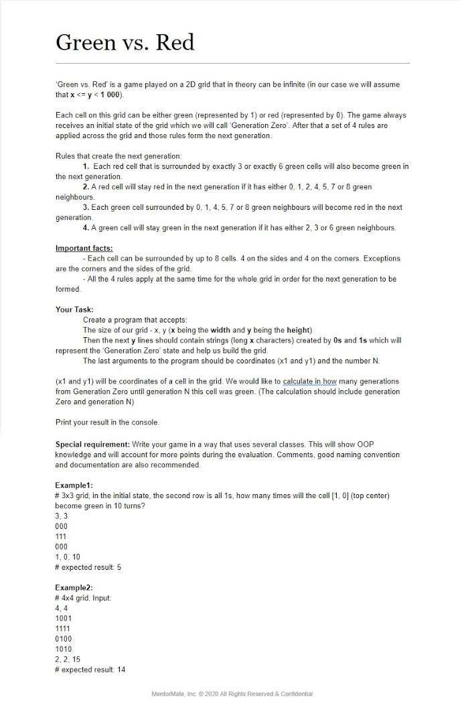

# Green vs Red

Green is represented by 1  
Red is represented by 0  
  

# Files

game.py - The file with the game  
readme.md - The readme file  
description.jpg - The full description of the task 

